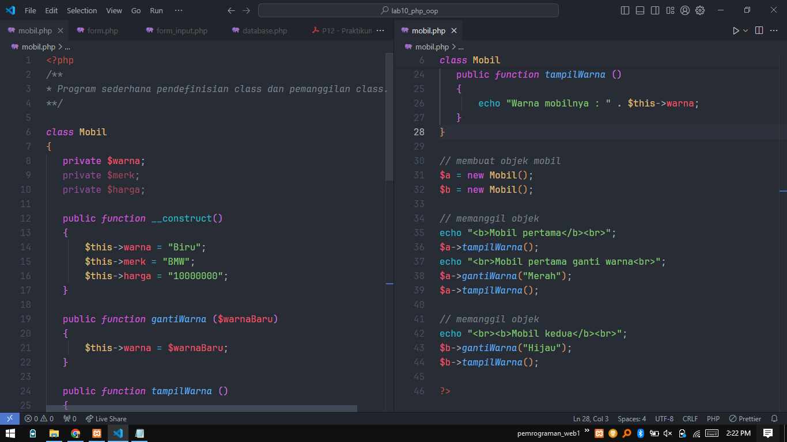
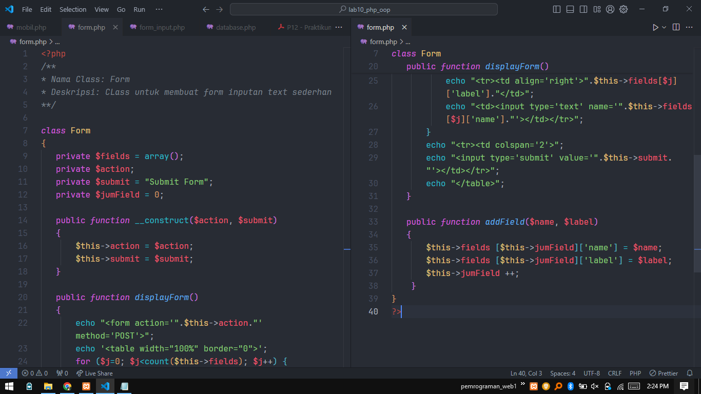
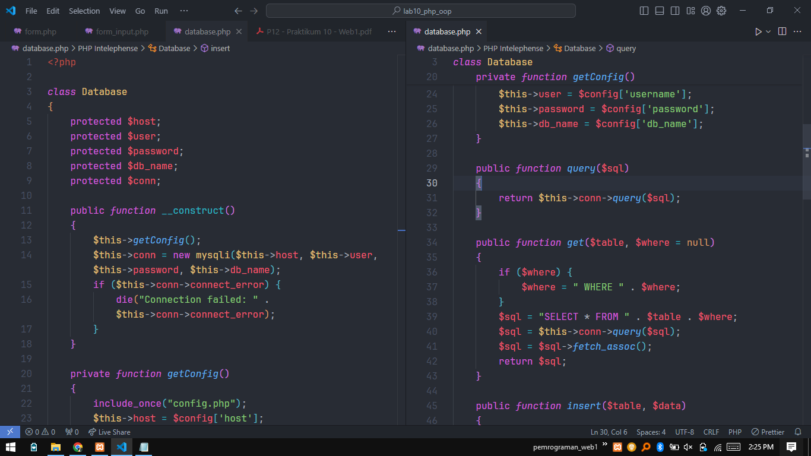
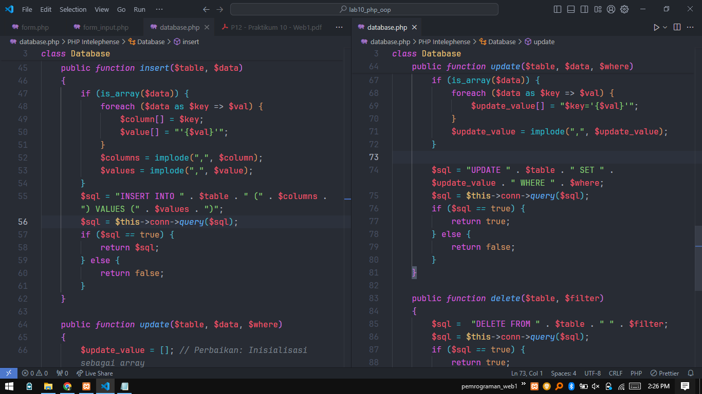
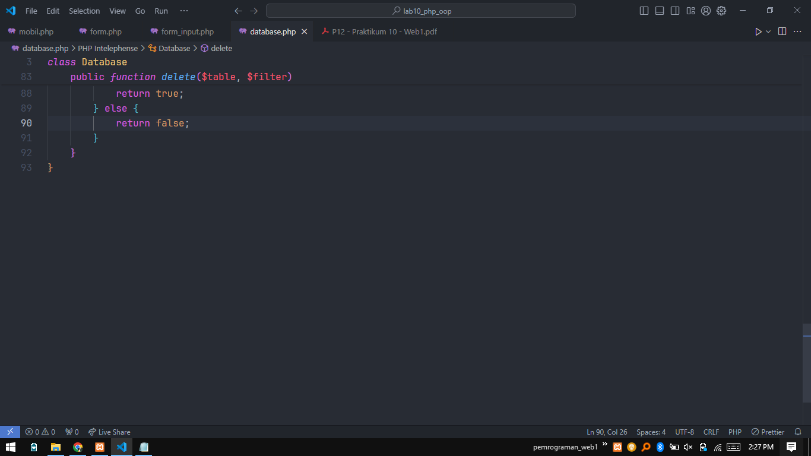

# Tugas Pertemuan 12 Pemrograman Web1
## Praktikum 10
### Aldi Hermansyah - 312310200 - Ti.23.A2

### Perubahan sesuai urutan:
```ada beberapa hal masih dalam perbaikan```
## 1. Buat file ```mobil.php``` <br>
   > 

## 2. Hasil ```mobil.php``` <br>
   > 

## 3. Buat file ```form.php``` <br>
   > 
   
## 4. Buat file ```form_input.php``` <br>
   > 
   
## 5. Hasil ```form_input.php``` <br>
   > 

## 6. Buat file ```database.php``` <br>
   > 
   > 
   > 
